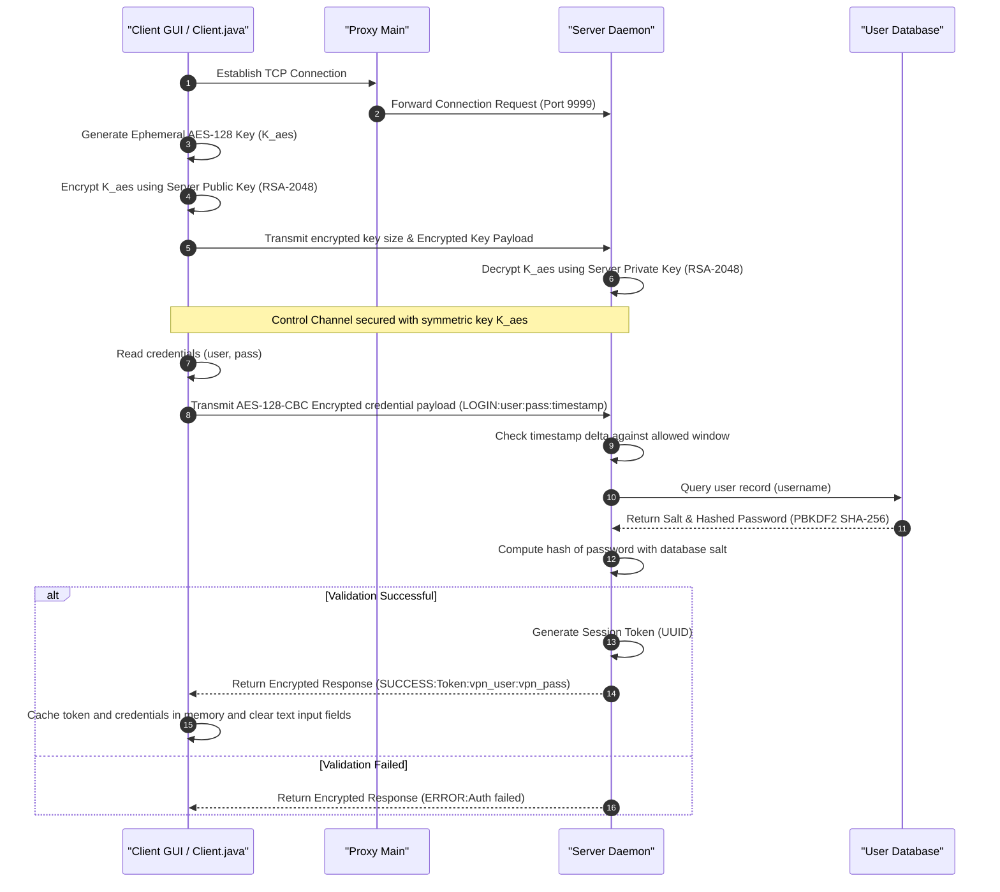

# Vanguard-VPN Professional: Technical Reference and Implementation Manual

## 1. Executive System Overview

Vanguard-VPN Professional is an enterprise-grade Virtual Private Network (VPN) middleware and client dashboard prototype written in Java. The system is designed to provide secure, cross-platform VPN tunnel orchestration using OpenVPN and WireGuard backends. It integrates a local zero-knowledge credential vault, a hybrid network latency engine, session-based pre-authorization, and Windows Filtering Platform (WFP) rules for DNS leak protection.

---

## 2. Core Architectural Components

```
                                    +-----------------------------------+
                                    |            Client GUI             |
                                    |     (functionality.ClientGUI)     |
                                    +-----------------+-----------------+
                                                      |
                                     (Command: LOGIN / REGISTER / CONFIG)
                                                      |
                                                      v
                                            +-------------------+
                                            |     VPN Proxy     |
                                            | (vpn_proxy.Proxy) |
                                            +---------+---------+
                                                      |
                                            (Encrypted Forwarding)
                                                      |
                                                      v
                                    +-----------------------------------+
                                    |       Authentication Server       |
                                    |      (functionality.Server)       |
                                    +-----------------+-----------------+
                                                      |
                                         (PBKDF2 SHA-256 Verification)
                                                      |
                                                      v
                                    +-----------------------------------+
                                    |           User Database           |
                                    |          (data/users.txt)         |
                                    +-----------------------------------+
```

---

## 3. Directory Structure

```
VPN Prototype/
├── config/
│   ├── app_config.properties          # Global system parameters
│   └── vpn_credentials.properties      # Downstream gateway credentials
├── data/
│   ├── users.txt                      # Hashed and salted authentication database
│   └── login_history.txt              # User authentication log history
├── keys/
│   ├── private.key                    # RSA 2048-bit Server Private Key
│   └── public.key                     # RSA 2048-bit Server Public Key
├── openvpn-configs/
│   └── [locations]/                   # Gateway configurations structured by platform
├── functionality/
│   ├── AppConfig.java                 # Config reader
│   ├── Client.java                    # Base network client and cryptographic routines
│   ├── ClientGUI.java                 # Dashboard Swing UI
│   ├── CryptoUtils.java               # Cryptographic primitives (AES, RSA, Hashing)
│   ├── NetUtils.java                  # Logging and utility functions
│   ├── Server.java                    # Authentication Daemon listener
│   └── UserValidator.java             # PBKDF2 DB validator and lockouts manager
└── vpn_proxy/
    ├── ProxyConfig.java               # Proxy parameters
    └── ProxyMain.java                 # Port forwarding listener
```

---

## 4. API & Component Reference

### 4.1. Client Subsystem (`functionality.Client`)
* `void getOrCreateSocket()`: Establishes a persistent TCP connection to the server or proxy. Performs the initial RSA-AES key exchange.
* `String sendCommand(String type, String param1, String param2)`: Packages a formatted command payload, adds an epoch timestamp to prevent replay attacks, encrypts the stream with the session key using AES-128-CBC, and transmits it.
* `String sendCredentials(String username, char[] password, String type)`: Converts password character buffers to byte arrays, executes `sendCommand`, and securely overwrites the memory arrays.
* `int pingServer(String host, int port)`: Performs a multi-stage latency check using a direct TCP connection. If the gateway blocks TCP, it falls back to DNS resolution tracking and injects a country-coded base latency calculation.

### 4.2. Client Dashboard Subsystem (`functionality.ClientGUI`)
* `void createAndShowGUI()`: Instantiates the Swing interface, registers layouts, configures themes, and triggers configuration queries.
* `void attemptConnectWithFailover(int startIndex, ...)`: Orchesrates connections to the selected gateway profiles. If a profile connection times out, it recursively falls back to the next available profile in the list.
* `void startWiFiAutoSecureMonitor()`: Launches a background monitor thread. If unsecured Wi-Fi interfaces are detected, it invokes the tunnel connection automatically if credentials have been pre-authorized.
* `void startStatsMonitor()`: Polls tunnel bytes sent/received and session uptime to update the dashboard monitoring graphics.

### 4.3. Authentication Subsystem (`functionality.Server`)
* `void main(String[] args)`: Starts the listening server on port `9999` and spawns a thread (`handleClient`) for each incoming socket connection.
* `void handleClient(Socket socket, PrivateKey privateKey, ...)`: Decrypts the incoming client session key using the private RSA key, processes control commands, validates login/register requests, and generates session tokens.

### 4.4. Cryptographic Core (`functionality.CryptoUtils`)
* `SecretKey generateKey(String passphrase)`: Derives a 128-bit AES key by hashing the passphrase via SHA-256 and copying the first 16 bytes.
* `byte[] encryptAES(byte[] data, SecretKey key)`: Encrypts data using AES-128-CBC with PKCS5 padding. Generates a random 16-byte IV and prepends it to the ciphertext payload.
* `byte[] decryptAES(byte[] data, SecretKey key)`: Extracts the first 16 bytes of the payload as the IV, and decrypts the remainder using AES-128-CBC.
* `byte[] encryptRSA(byte[] data, PublicKey key)` / `decryptRSA(byte[] encryptedData, PrivateKey privateKey)`: Performs asymmetric encryption and decryption operations.

---

## 5. Security & Cryptographic Handshake Protocol

### 5.1. Initialization Sequence Diagram



### 5.2. Payload Specifications

#### 1. Registration & Authentication Payload
Encrypted payload string format:
`[TYPE]:[USERNAME]:[PASSWORD]:[TIMESTAMP]`
* **TYPE**: `REGISTER` or `LOGIN`
* **USERNAME**: User profile identifier.
* **PASSWORD**: User master password.
* **TIMESTAMP**: Linux epoch time (in milliseconds) of transmission.

#### 2. Configuration Retrieval Payload
Encrypted payload string format:
`GET_CONFIG:[PLATFORM]:[FILE_IDENTIFIER]|[MULTIHOP_FLAG]:[TIMESTAMP]`
* **PLATFORM**: Operating system string (e.g. `windows`).
* **FILE_IDENTIFIER**: Configuration profile file name.
* **MULTIHOP_FLAG**: `true` if multi-hop routing is selected.

---

## 6. Threat Model and Security Controls

| Threat Category | Potential Vulnerability | System Mitigations & Controls |
| :--- | :--- | :--- |
| **Credential Exposure** | Dumped RAM logs exposing cleartext user password values. | Use of `char[]` arrays. Character fields are overwritten with zeros immediately after authentication, preventing credential recovery from memory. |
| **Replay Attacks** | Capturing and retransmitting encrypted socket connection frames. | Timestamps are embedded in all AES packets. Packets exceeding a 30-second window are discarded by the server. |
| **DNS Leaks** | DNS queries leaking to the local ISP through non-VPN network interfaces. | Integration with the Windows Filtering Platform (WFP) driver. WFP filters block outbound port 53 traffic on all interfaces except the active VPN TAP adapter. |
| **Wi-Fi Hijacking** | Unsecured access points capturing client traffic before connection. | The Auto-Secure daemon monitors network connectivity changes. Upon identifying an untrusted SSID, it connects the VPN automatically. |
| **Forensic Storage Analysis** | Recovering raw OpenVPN credentials or config files from local storage. | Temporary files are overwritten with zero bytes (`0x00`) before they are deleted from the disk. |
| **Shell/Command Injection** | Malicious command arguments executed during privileged JVM relaunch. | Strict regex argument sanitization (`^[a-zA-Z0-9_\-\.]+$`) and literal parameter quoting (`'`) inside elevated PowerShell parameters. |
| **System Directory Pollution** | Elevated processes writing config/logs to `C:\Windows\System32`. | Forced working directory binding. Launcher dynamically resolves its source directory and sets both JVM location and process-level environment constraints back to the local folder. |
| **Resource Exhaustion** | Elevated processes consuming unchecked CPU/RAM causing host instability. | Hard memory limit bounds (`-Xmx256m -Xms64m`) enforced during UAC JVM invocation to protect host infrastructure. |

---

## 7. Execution Guide

### 7.1. Prerequisites
* **JDK**: Version 17 or higher.
* **OpenVPN**: OpenVPN command-line executable installed on the client machine.
* **Administrator Privileges**: The client must run in an elevated shell to configure network routes and assign IP configurations.

### 7.2. Global Settings (`config/app_config.properties`)
Modify configuration values prior to launch:
```properties
server.host=127.0.0.1
server.port=9999
auth.timestamp.window.ms=30000
openvpn.exe.win=C:\\Program Files\\OpenVPN\\bin\\openvpn.exe
listenPort=8888
forwardHost=127.0.0.1
forwardPort=9999
path.users=data/users.txt
path.history=data/login_history.txt
path.auth=vpn-auth.txt
config.dir=openvpn-configs
```

### 7.3. Automated Build & Packaging
Run the automated batch script to compile and assemble the unified `Vanguard-VPN.jar`:
```powershell
.\build.bat
```
This script automatically compiles the classes, generates the JAR with `Launcher` as the main entry point, and removes the temporary `.class` files.

### 7.4. Execution Sequence via Unified JAR

#### 1. Start the Authentication Server
```powershell
java -jar Vanguard-VPN.jar server
```

#### 2. Start the VPN Proxy
```powershell
java -jar Vanguard-VPN.jar proxy
```

#### 3. Run the Client Dashboard (With Auto-Elevation Failsafes)
Launch the Client. If the shell is non-elevated, the launcher automatically requests UAC elevation and binds execution safely to the JAR directory:
```powershell
java -jar Vanguard-VPN.jar client
```
*(Or simply double-click `Vanguard-VPN.jar` in Windows Explorer)*

#### 4. Run the Test Suite
```powershell
java -jar Vanguard-VPN.jar test
```
